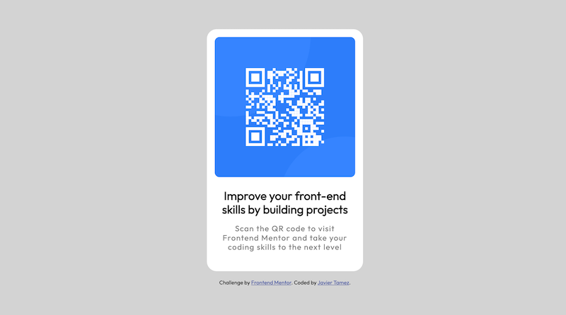

# Frontend Mentor - QR code component solution

This is a solution to the [QR code component challenge on Frontend Mentor](https://www.frontendmentor.io/challenges/qr-code-component-iux_sIO_H). Frontend Mentor challenges help you improve your coding skills by building realistic projects.

## Table of contents

- [Overview](#overview)
  - [Screenshot](#screenshot)
  - [Deployment](#deployment)
- [My process](#my-process)
  - [What I learned](#what-i-learned)
  - [Continued development](#continued-development)
  - [Useful resources](#useful-resources)
- [Author](#author)

## Overview

### Screenshot

### Deployment
[Live Site](https://prowlinglynx.github.io/FEMentor-qr-code-component/)
### Built with

- Semantic HTML5 markup
- CSS properties

### What I learned
I learned that when starting a simple project I tend to get sloppy with planning my approach. I realize now that even a little bit of planning would have helped in avoiding some embarassing mistakes.

I also learned that css organization is just as important for readability like other languages. I was able to brute force my way in this instance because of the small size of this project. If the project was larger I would have had trouble finding and updating the css I needed.

### Continued development

I did not need any additional build tools or Javascript for this project, but it showed that I will need to focus on plain css instead of using frameworks like bootstrap. I also will endeavour to plan my approach better for a more efficient workflow.

### Useful resources

- [W3 Schools](https://www.w3schools.com/) - I used this site to look up css properties and examples in their use. I prefer it over MDN because of ascetics and the minimal detail provided.
- [MDN](https://developer.mozilla.org/en-US/) - My go to documentation for most things web development. It provides a lot of detail and code examples. However, it's easy to get overwhelmed by the amount of information provided if you aren't sure what you are looking for.

## Author

- Github - [Javier Tamez@ProwlingLynx](https://github.com/ProwlingLynx)
- Frontend Mentor - [@ProwlingLynx](https://www.frontendmentor.io/profile/ProwlingLynx)
